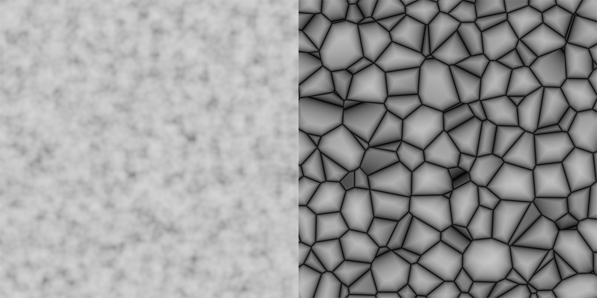
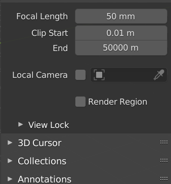
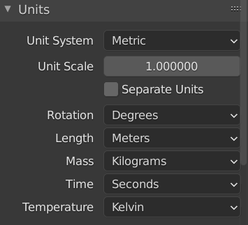
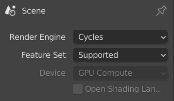
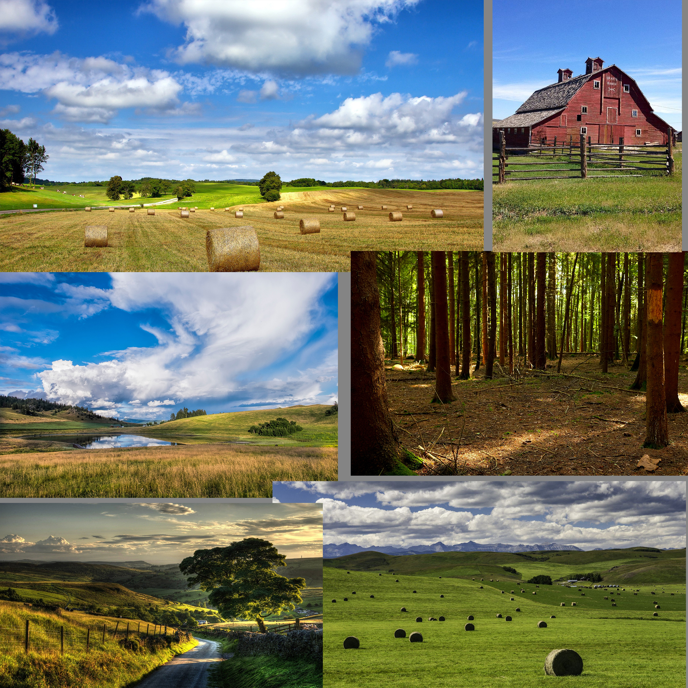

### Your first day introduction to procedural terrain creation using blender and unity.

Procedural means creating things algorithmically, you input some data into an algorithm and the algorithm outputs some predictable yet random result...for example in "uniform random point distribution in a circle" the input was "radius" and "sampleCount" and output was "random uniform points distribution in the circle".

Fractal noises are one such category of algorithms, you input some parameters and in almost all cases the output are 0 to 1 normalized values, they have uses in other fields however in CG they are mostly use for creating procedural textures, terrains, rocks and sometimes generative art.

In this first introduction to procedural terrain creation techniques we will utilize various noises such as "perlin" and "veronai* to generate a procedural terrain shape, we will also create materials to generate height maps and splat maps for exporting this terrain to other software packages like unity or unreal game engines.

As I have mentioned in my intro most if not all of my tutorials are aimed at intermediate level users so fair bit of knowledge of whatever software you are using is expected.

First let's setup blender scene for a terrain creation workflow so perform the following steps.
1. Create a new scene and delete all items. 
2. Landscapes are large with default camera clip settings it is not possible to view entire landscape at once, so set camera's far clip position to a large value, I have set it to 5km.

3. Since we want to export this terrain to unity which uses metric units system so set blender to use that as well, it's not necessary but it will help to keep scale constant between unity and blender. 

 

4. Also make sure render engine is set to cycles. 

In blender there are two ways to generate fractal noises 
* 1st is simple, by using built in procedural textures and using them with displacement modifier.
* 2nd is complex, by using cycles material displacement.

Since this is your first day we will go with simple method.

As with any art work it is always a good idea to collect some reference images and write down your idea so you don't end up making decisions on the fly during production, with that said here is our simple design document.

*Terrain type : grass lands with hills and distinct mountains.  
size : 2 km square.  
art style : realistic.  
references images :*

*As an important note, the workflow for creating terrains is that we always begin by defining larger shapes, composition of terrain then creating medium details and finally smaller finer details, and always remember to compare what you are creating with your reference images to keep things consistent and natural.*

OK, now let's begin by creating the larger terrain shapes.