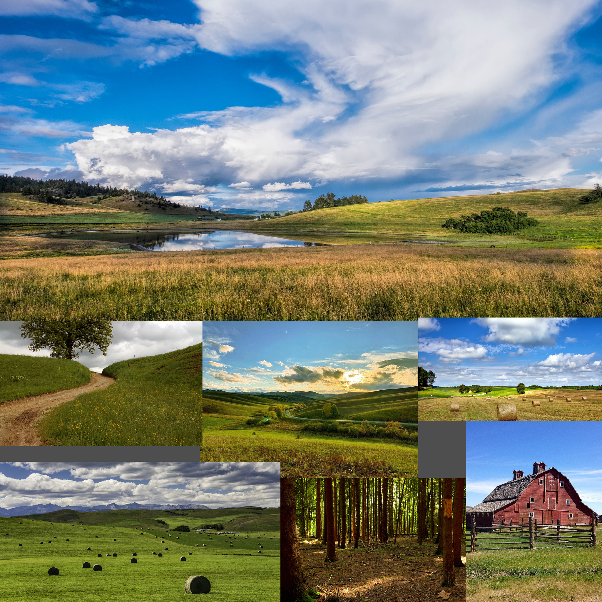
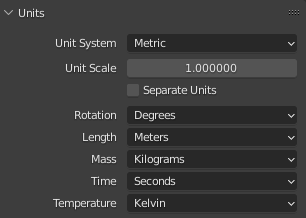
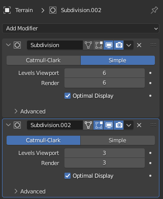
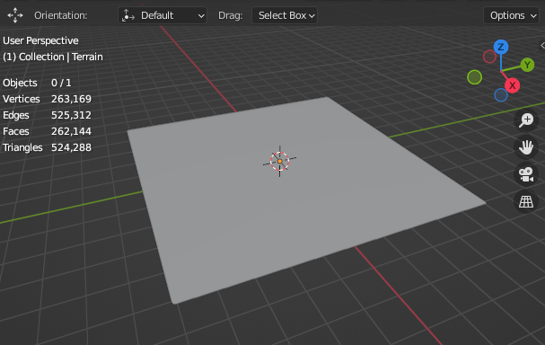
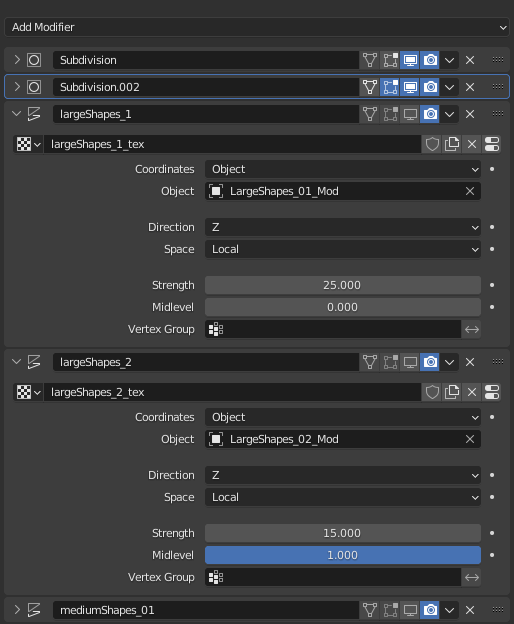
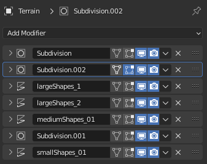
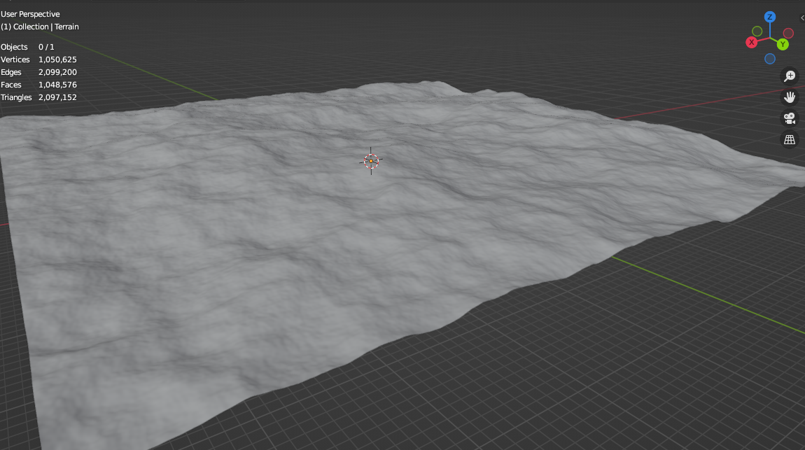

### Base terrain generation
Procedural means generating data algorithmically, in world of terrains and landscapes we do this with procedural noises, almost all specialized terrain generation software world machine, world creator etc. use procedural noises to generate terrain.

Blender is not a specialized terrain creation software but it has built in support for generating different noises.

We can do this using blender displacement modifiers with procedural noise textures for displacement.

**_Before we begin production, it is always a good idea to do some post production so that we don't end up making decisions on the fly, with that said here is our design document._**

Terrain size : 1 km   
Type : typical grasslands with forest areas  
Time of day : clear evening   
Reference images

Since terrains are large make sure to set camera far clipping to a large value and scene SI units to metric.

 

Add a new plane of 1km, rename it to Terrain, and add some subdivisions using subdivision modifier, I have raised poly count to 1k to get nice large details.

 

So now far actual displacement, **_the way for creating terrain shapes is such that we begin by creating large shapes first than moving on to medium and finally adding small fine details._**

So I began by adding displacement modifiers step by step with procedural textures for displacement, defining large to medium terrain shapes and only adding a new modifier when I am happy with results of first, I am using a mix of voronoi and perlin textures with varying parameters.

 

You may have noticed that we cannot randomize noise generated by procedural textures, but there is a work around...create a new empty and set your displacement modifier (the one you want to randomize) to use object coordinates and set object to the empty you created, now move, rotate or scale to randomize corresponding displacement modifier.

I have also added a average human size cube to get judgement about terrain.

 

As a final step for adding fine details I added another subdivisions modifier raising poly count to 2k and added a new displacement modifier with a perlin noise with subtle strengths, here is my final modifiers stack.

 

And there you have it a procedural terrain.

 

### Creating a height map & importing in unity

### Creatign a splat-map and texturing
In last tutorial we created a height map and imported into unity for testing, In this part we will create a splat map in blender and use it to texture out terrain in unity.
This will not be a step by step tutorial rather I will give you an overview of the process.

So what is a splat map...? basically splat mapping is a procedural texturing technique for terrains, a splat map is just another image where each RGBA channel of image corresponds to a terrain texture on terrain, for example 
R(Red) channel can be = dirt texture on terrain
G(Green) channel can be = grass texture
B(Blue) channel can be = rock / cliff
A(Alpha) channel can be = snow 

So now you know what a splat map is, now I will walk you through the process on how to create a splat map.

Before proceeding just a disclaimer creating splat maps requires good understanding if some mathematical concepts and intermediate knowledge of blender cycles nodes, so if you just want a quick splat map shader use the one provided with project files.

Since our terrain has no rocks or cliffs instead we have forests, so in our splat map

red channel = dirt / ground texture
green channel = grass texture
blue = forests map
alpha = road overlay map

First for red and green channels, I choose all the surface that are flat beyond some threshold, (since buildings will be placed on flat surfaces) to be dirt / ground texture and everything else is green channel. 
Terrain surface steepness can be calculated using the formula 
and to control the blending between steep and flat surfaces I am using a logistics function formula

For forest map (blue) I am using a noise texture and over laying it on top of existing channels

and that's it for a now we will create road overlays map (alpha channel) in some next part.

Now to bake this splat map,  create new texture splat map 2048 * 2048 with alpha channel.

Add a new *image in terrain **splatMap** shader without connecting it to anything, make sure to select it.

