## This tutorial is created for [CodeCreatePlay](https://www.patreon.com/CodeCreatePlay, "CodeCreatePlay") patreon page.

### 1. Creating base terrain
Procedural means generating data algorithmically, in world of terrains and landscapes we do this with procedural noises, almost all specialized terrain generation software world machine, world creator etc. use procedural noises to generate terrain.

Blender is not a specialized terrain creation software but it has built in support for generating different noises.

We can do this using blender displacement modifiers with procedural noise textures for displacement.

**_Before we begin production, it is always a good idea to do some post production so that we don't end up making decisions on the fly, with that said here is our design document._**

Terrain size : 1 km   
Type : typical grasslands with forest areas  
Time of day : clear evening   
Reference images / mood-board

So now for production, since terrains are large make sure to set camera far clipping to a large value and scene SI units to metric.

 

Add a new plane of 1-km, rename it to **Terrain**, and add some subdivisions using subdivision modifier, I have raised poly count to 1-k to get nice large details.

 

So now far actual displacement, **_the way for creating terrain shapes is such that we begin by creating large shapes first than moving on to medium and finally adding small fine details, there are other ways to do this, but here I will use displacement modifiers with procedural textures_**

Select **terrain** game object and from modifiers tab add a new displacement modifier, rename it to **large shapes**.
Add a new texture for this modifier, rename it to large **large shapes_tex**.
You can play with settings of both the displacement modifier and it's corresponding texture, or just copy mine.

 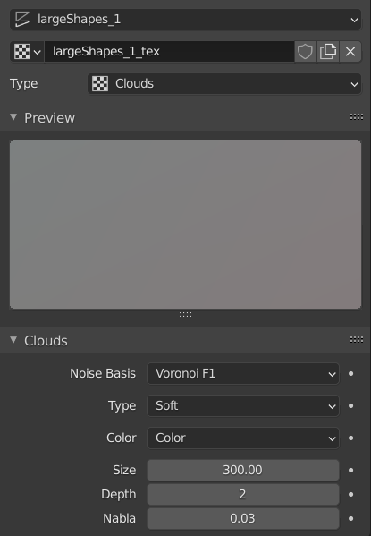

You may have notice by default we cannot randomize noise for some fixed values however there is a fix to it, add a new empty **Add > Empty > PlainAxis** rename it to **largeShapes_01_mod**, select **large shapes** displacement modifier, change coordinates to **object** and from **Object** drop down select **largeShapes_01_mod**.  
Now move, rotate, scale **largeShapes_01_mod** to randomize terrain shape.

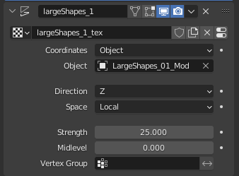 

Now I have created 2 more displacement modifiers, to add some variation and to create medium terrain shapes, 

 

I have also added a average human size **(Dimensions x = 0.25m y = 0.25m z = 1.8m)** cube to get judgement about terrain.

 

As a final step for adding fine details I added another subdivisions modifier raising poly count to 2k and added a new displacement modifier with a perlin noise with subtle strengths, here is my final modifiers stack.

 

And there you have it a procedural terrain, that fits the criteria of grasslands and scattered forest areas, from our design document.

 

### 2. Creating a height map & importing in unity

**Creating a height map is easy, I will you through the process step by step.**

1. Open the blender file from last part or (final.blend) from project files, from output properties tab, set format settings as...

   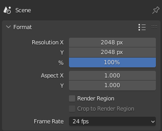

2. Create a new camera, set it's mode to orthographic and set the settings as follows...

   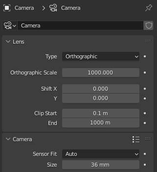

3. Position the camera right above the terrain center, go to camera view (**view > camera > active camera**), make sure entire terrain is completly visible and there is no clipping and that terrain is entirly covered by camera.

   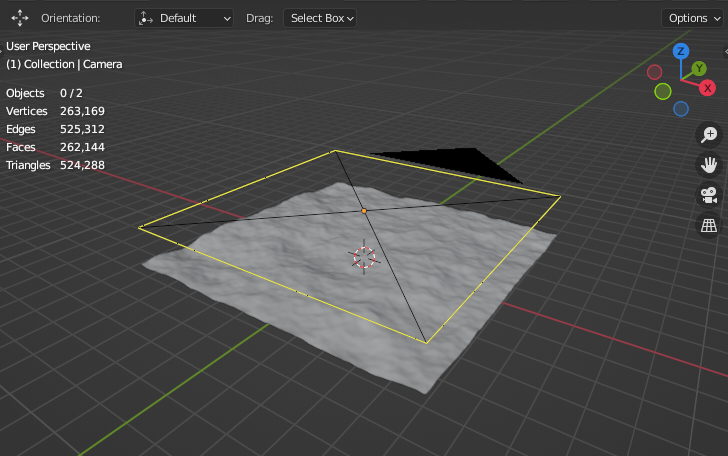
   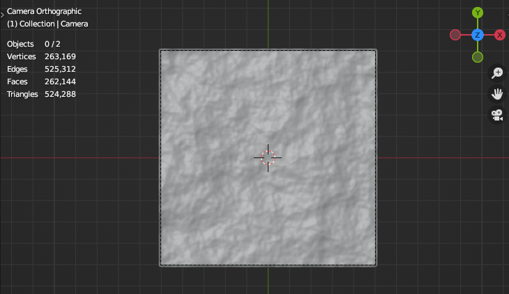

4. Now we will create a height map, create a new shader, rename it to **heightMap** and replace default principled shader with emission shader.

    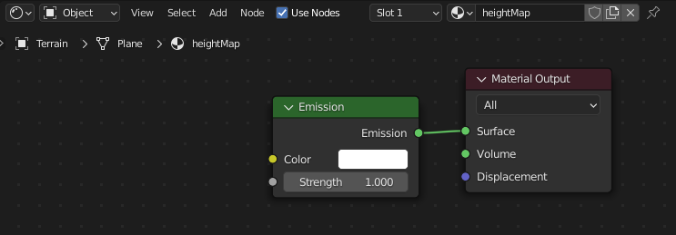

   **_"A height map is a black and white image representation of terrain, where each pixel represents a position on terrain, black at value 0 being the lowest and white at value 1 the highest part of terrain."_**
 
5. We only need the z-component of the vertices I.e height value, so to get the position of vertices add a new **geometry node** and a **seperate xyz** node, connect output of position from **geometry node** to vector input of **seperate xyz** node.

   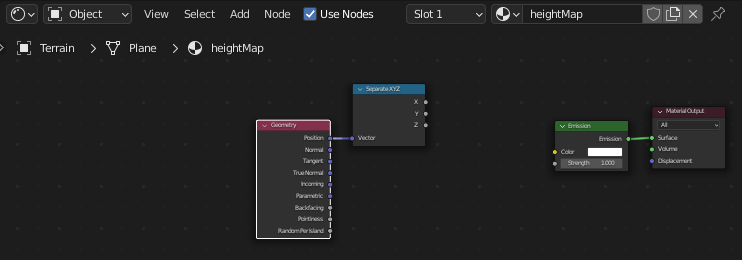
 
6. Ideally when rendering out a height map, the lowest part of mesh should have a height value of 0 and top height value should be calculated relative to lowest value, however blender is not a specialized terrain creation software and we need a work around.

7. Add a new **Map to range** node, connect **z** output of **seperate xyz** to input value of **Map to range**.

   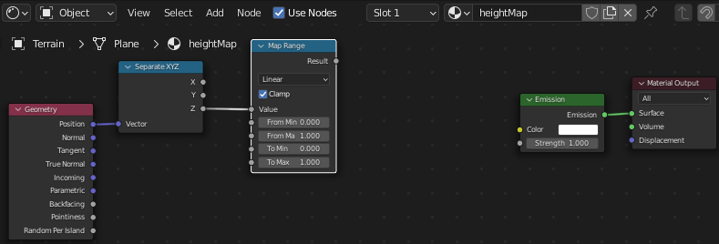

8. Add a new **Add > Mesh > Plane** scale it up a bit, snap it to lowest most part of terrain and note its position's z value, and plug that into **Map to range** **from min value**, similarly snap the plane to top most vertex of terrain and plug position's z value to **from max value** of **Map to range**.
Here are my values.

   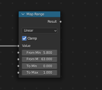

9. To make sure image is black and white completly in range 0 to 1 connect output of **Map to range** to a **ColorRamp** node and finally plug color output of **ColorRamp** to color input of **Emission shader**.

   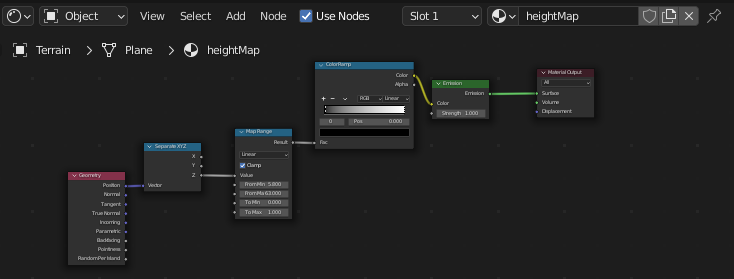

10. Now we need to change some settings in order to render a proper height map
   * first switch to material view to view the current output of height map shader.
   * from scene settings change rendering engine to cycles and samples to 1.
   * Blender by default apply some view transformation to final image, however we only need the raw black and white image, so to get the raw image select **View Transform** to **Raw** in **Color Management** in render properties tab.

     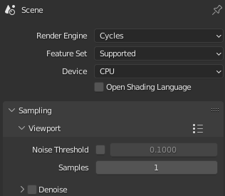
     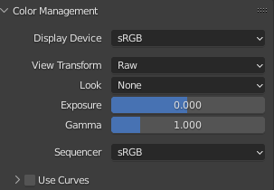

11. My final material view...

    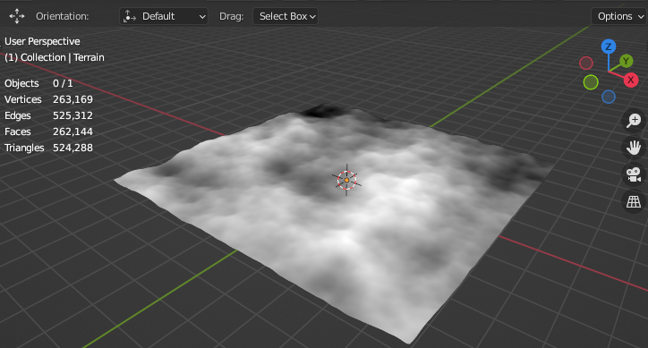

12. From Outliner hide all objects from both scene and render views, except terrain and camera, finally hit f-12 to bake the height map, save the heigh map as .png with following settings.

    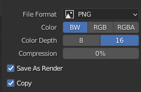

13. Unity terrain system can only accept **.raw** file formats, so to convert **.png** to raw use some online image format conversion, however here I have opened it in photoshop and saved it as **photoshop raw**.

14. 

### 3. Creating a splat-map
In last tutorial we created a height map and imported into unity for testing, In this part, I give you an overview of what a splat map is and show you how to use splatMap shader included with project files.  
**_Tutorial for creating a splat map shader deserves a seperate tutorial of it's own and so it is for some other day._**

**So what is a splat map...?** basically splat mapping is a procedural texturing technique for terrains, a splat map is just another image where each RGBA channel of image corresponds to a terrain texture on terrain, for example  
R(Red) channel can be = dirt texture on terrain  
G(Green) channel can be = grass texture  
B(Blue) channel can be = rock / cliff  
A(Alpha) channel can be = snow   

_If you have project files, then you can simply append **splatMap shader** from **terrainFinal.blend** into your blender scene or simple open **terrainFinal.blend** in blender._

And here is how the splat map shader looks like.

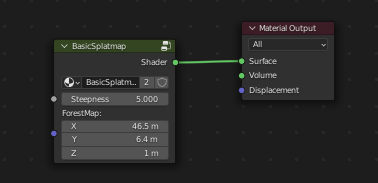

* The **Steepness** value controls red channel, it means steepness ranging fron 0 to the value you will set, for example as in this image it means steepness from 0 to 5 degreees.
* The second param **ForestMap** (blue channel) controls the positioning of noise textures used as forest mask.

Since this terrain has no rocks or cliffs, so in this splat map
* I have chosen **red channel** to be ground / dirt textures, and selected flat areas 0 to 5 degrees, since this is where buildings will be placed.
* Green is grass.
* And blue is forest mask.

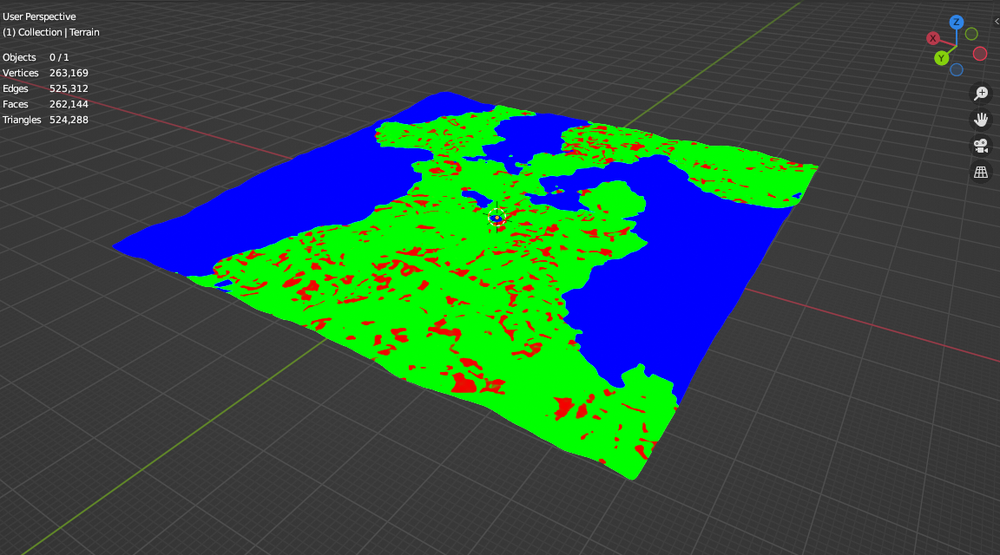

Now before baking this splat map, make sure to turn off last two modifiers we added to add small fine details, otherwise you would get noise in your image

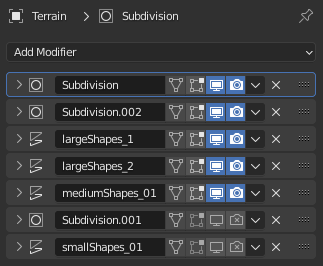

Also change change **View Transform** to **standard** in **Color management.**  
And now to bake this splat map, open image editor, create a new image, size same as height map.

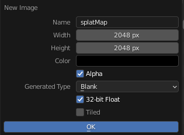

Add a new **Image texture** node in shader editor and select the splat map image.

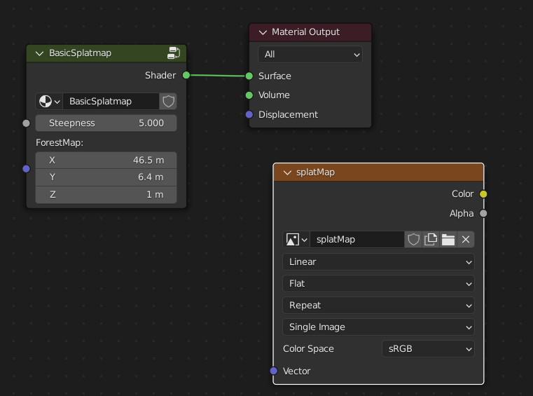

Now select this **Image texture** node and select the terrain object, go to Bake options and bake a diffuse map.

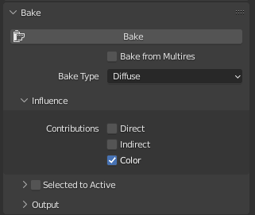

Finally save the image as tiff without any compression.

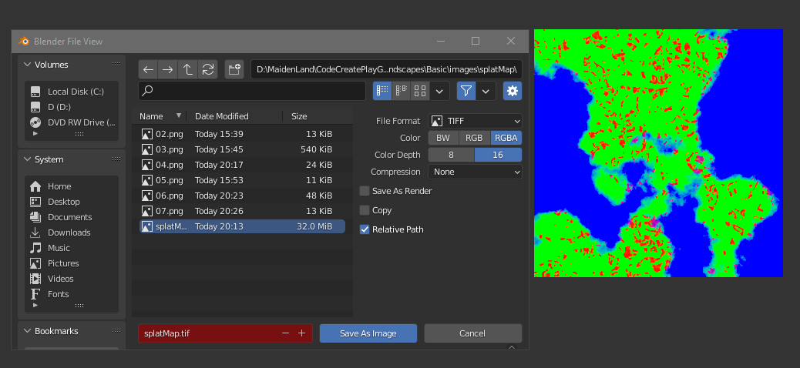

### 4. Importing heightmap into unity and applying the splat map

Open unity and add a new **GameObject > 3d Object > Terrain** and go to **Terrain settings > Texture resolutions on terrain > import raw and select the heightMap we created earlier (or just grab them from project files if you want to follow along me).**  
Set the settings as (mac users should set byte order to mac)

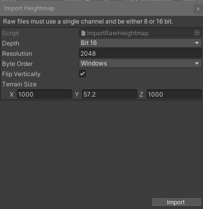

Terrain size's x and y values are width and length of terrain which is 1-km, and y is height, it will depend on that **MapToRange** node from height map tutorial.  

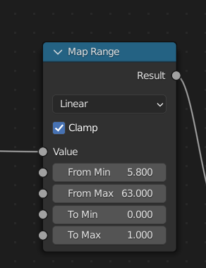

It is calculated as (height = From max - From min value) to get the actual height of terrain.  
Finally in terrain settings, set **Draw Instanced** to True and set **Pixel error = 1** to get a high quality terrain.

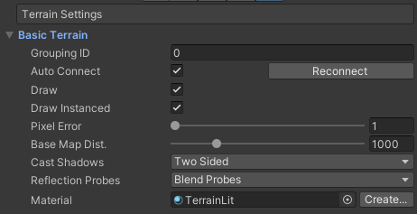
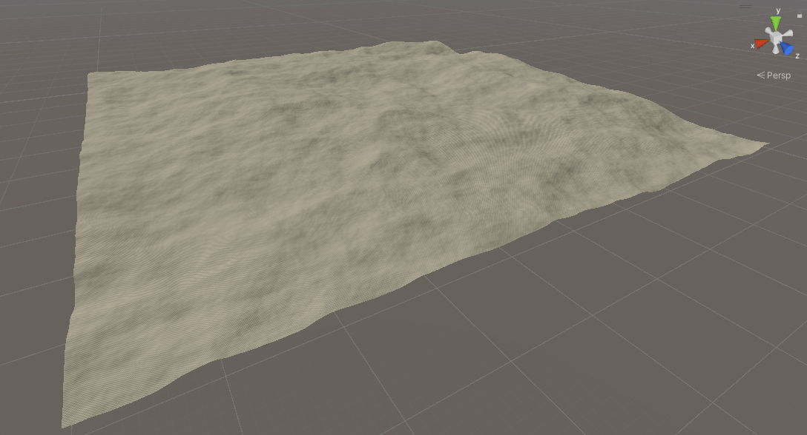

We have a height map terrain, now for texturing, import splat map into unity, go to splatMap's **import settings > advanced > set Read/Write enabled to true.**  

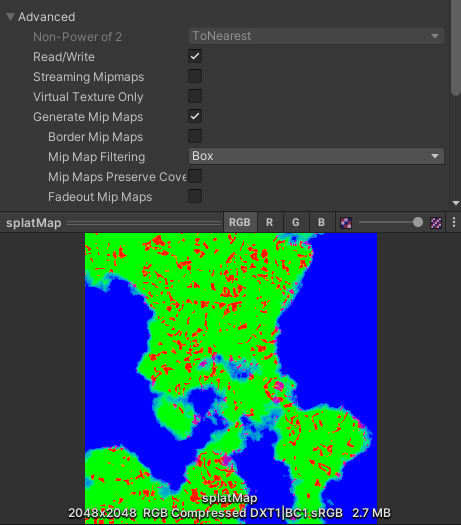

At this point we need some pbr terrain textures and corresponding terrain layers to texture this terrain, creating pbr textures frm terrains is out of scope of this tutorial however I have provided these textures with corresponding terrain layers in project files.  
In terrain paint mode set terrain layers in right order

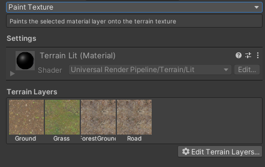

To procedurally apply these splat maps we need a terrain shader or script I have provided one in project files.
Just attach **SplatMap.cs** script to your terrain game object, drag splat map texture to splat map slot and hit **Apply**, and there you have it.

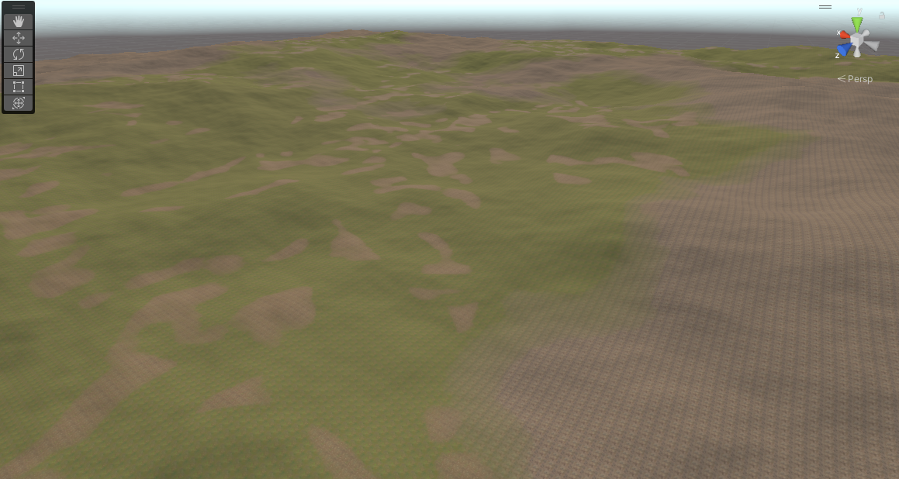
  
**_Ok that's it for now in next part we will start lightning and look development & if you like this tutorial please support me on [CodeCreatePlay](https://www.patreon.com/CodeCreatePlay, "")_**.

