## Open world terrain production basics (Part-02)

**_If you are a **[Patreon](https://www.patreon.com/CodeCreatePlay)** than you can download project files for this tutorial which has all the scenes and assets included and setup._**

**_DM me on **[CodeCreatePlay](https://www.patreon.com/CodeCreatePlay)** page to report any mistakes, typos or give feedback._**

**In last part we created a terrain in blender, in this part we will create a height map inside blender using cycles to export this terrain to unity.**

1. Open the blender file from last part or (final.blend) from project files, from output properties tab, set format settings as...

   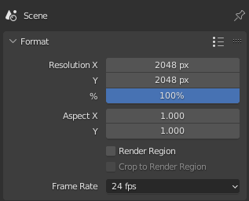

2. Create a new camera, set it's mode to orthographic and set the settings as follows...

   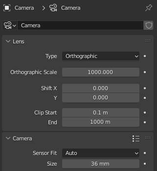

3. Position the camera right above the terrain center, go to camera view (**view > camera > active camera**), make sure entire terrain is completly visible and there is no clipping and that terrain is entirly covered by camera.

   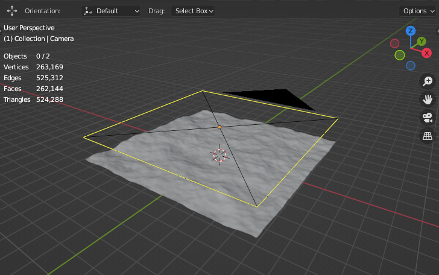
   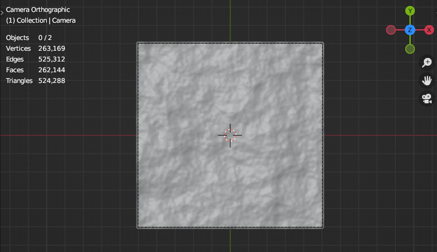

4. Now we will create a height map, create a new shader, rename it to **heightMap** and replace default principled shader with emission shader.

    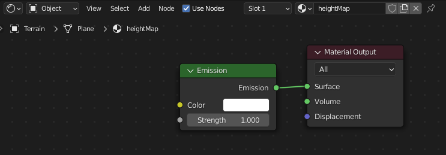

   **_"A height map is a black and white image representation of terrain, where each pixel represents a position on terrain, black at value 0 being the lowest and white at value 1 the highest part of terrain."_**
 
5. We only need the z-component of the vertices I.e height value, so to get the position of vertices add a new **geometry node** and a **seperate xyz** node, connect output of position from **geometry node** to vector input of **seperate xyz** node.

   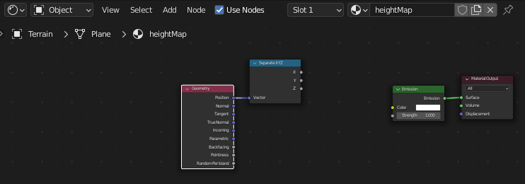
 
6. Ideally when rendering out a height map, the lowest part of mesh should have a height value of 0 and top height value should be calculated relative to lowest value, however blender is not a specialized terrain creation software and we need a work around.
7. Add a new **Map to range** node, connect **z** output of **seperate xyz** to input value of **Map to range**.

   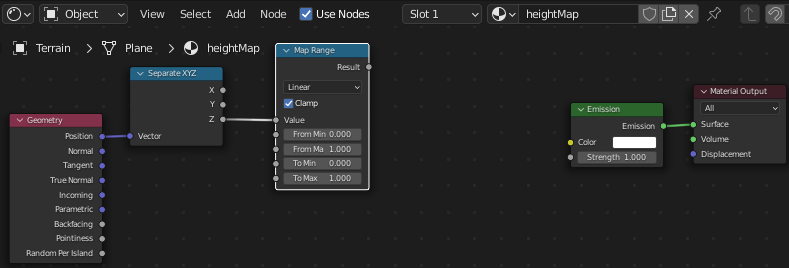

7. Add a new **Add > Mesh > Plane** scale it up a bit, snap it to lowest most part of terrain and note its position's z value, and plug that into **Map to range** **from min value**, similarly snap the plane to top most vertex of terrain and plug position's z value to **from max value** of **Map to range**.
Here are my values.

   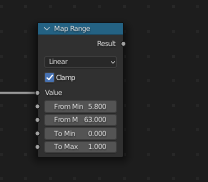

8. To make sure image is black and white completly in range 0 to 1 connect output of **Map to range** to a **ColorRamp** node and finally plug color output of **ColorRamp** to color input of **Emission shader**.

   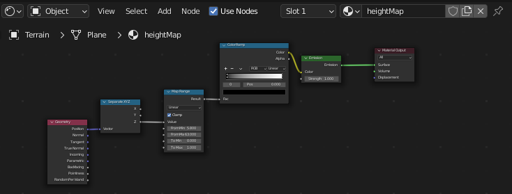

9. Now we need to change some settings in order to render a proper height map
   * first switch to material view to view the current output of height map shader.
   * from scene settings change rendering engine to cycles and samples to 1.
   * Blender by default apply some view transformation to final image, however we only need the raw black and white image, so to get the raw image select **View Transform** to **Raw** in **Color Management** in render properties tab.

    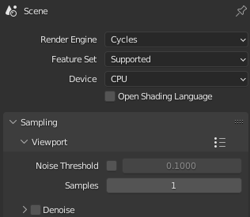
    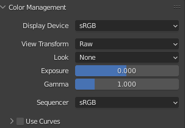

10. My final material view...

    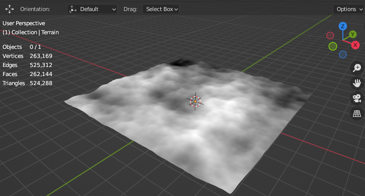

11. From Outliner hide all objects from both scene and render views, except terrain and camera, finally hit f-12 to bake the height map, save the heigh map as .png with following settings.

    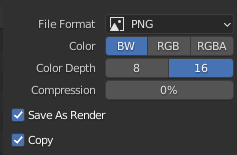

