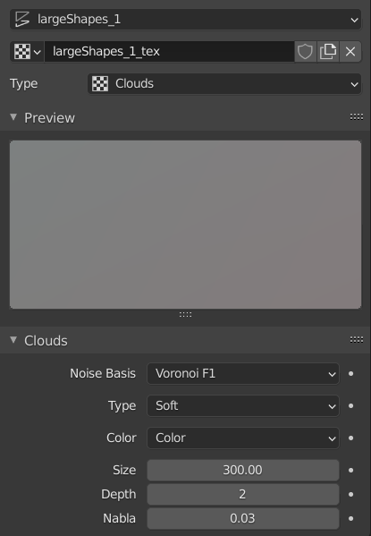
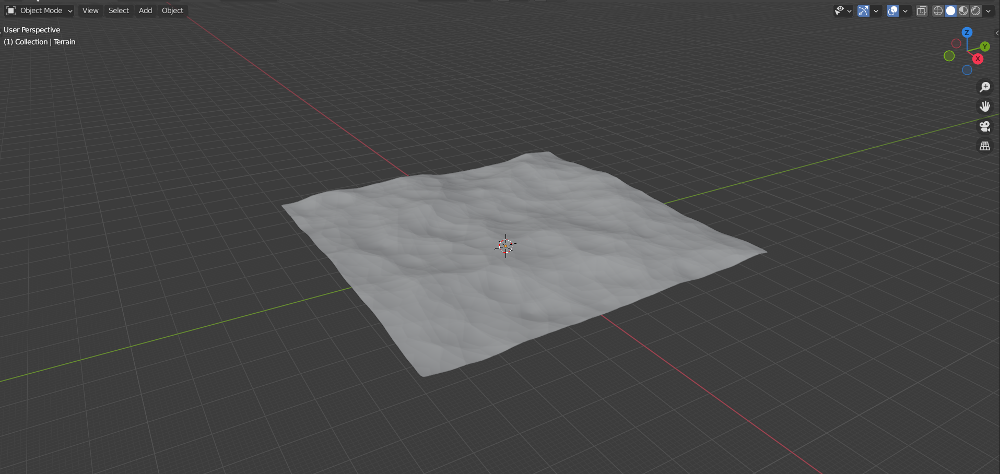

## Your first day at procedural terrain creation techniques

In this tutorial, you will learn how to create a procedural terrain. We will start by creating  
1. terrain in blender, nothing fancy just 1-km so that you get the idea of the process.
2. then creating shaders for generating a height map and a splat map to import this terrain to Unity engine.
3. Finally we will do look dev inside unity.
 
 
 
### Prerequisites
1. Intermediate level understanding of **Unity** and **Blender**.
2. You should have some art assets including trees, grasses, rocks and terrain textures that work with unity's **URP render pipeline**.
3. A terrain shader or script that can apply **splat maps** for unity terrain.

**If you are a **Patreon** than you can download project files for this tutorial which has all the scenes and assets included and setup.**

**DM me on **CodeCreatePlay** page for any to report mistakes or give feedback.**

### Introduction
Procedural means generating data mathematically, behind these algorithms are mathematical formulae that take input from user and output some random yet predictable result.
Fractals or noises are one such category of procedural algorithms there most use cases in CG are procedural generation of terrain and textures.
These noises can also be mixed, layered or stacked on top of each others to create interesting visuals.

### PreProduction
It's always good idea to have things planned out before we begin working in software, this is called **Pre-Production**, in this stage you will write down your idea and collect reference images that will include type of environment, color palette, style etc.

With that said here is our design document and some reference images.

### Design document
Terrain size : 1 km  
Type : typical grasslands with forest areas  
Time of day : clear evening  

### Blender scene setup
First we will prepare a scene that will make sure for smooth export to unity or unreal engine and also for viewing and editing landscapes in blender 3D viewpoint.
1. Open a new blender scene and delete all default scene objects.
2. From **Render properties** panel set **Rendering engine** to cycles.

   

3. From **Scene Properties** panel set unit system to metric since this is what unity uses.

   

4. Since terrains are large we need to set far camera clip position to a large value so entire terrain is visible without any clipping, go to view and set clip end to a large value

   

5. Save this scene as **terrainStart**.

### Production
1. Open **terrainStart** blender scene**.
2. Add a new **plane** and set it's size to 1-km, rename it **terrain**.

   

3. To modify this mesh we need to give it some geometry, this is a very small terrain, 1-km only, so about poly count of 1-k will be more than enough to high enough details, add two new subdivision modifiers and set the settings as following

   

4. _The way with creating landscapes is that first we define larger and bigger shapes then move to medium and small details_. There are other ways to do this, but here I will use displacement modifiers with procedural textures.

5. Select **terrain** game object and from modifiers tab add a new displacement modifier, rename it to **large shapes**.
Add a new texture for this modifier, rename it to large **large shapes_tex**.
You can play with settings of both the displacement modifier and it's corresponding texture, or just copy mine.

   _**A tip here is to not over do any feature & keep features amount relative to terrain size, always looking from player's perspective to get an idea of how everything is going to look in game.**_

   
   

6. You may have notice by default we cannot randomize noise for some fixed values however there is a fix to it, add a new empty **Add > Empty > PlainAxis** rename it to **largeShapes_01_mod**, select **large shapes** displacement modifier, change coordinates to **object** and from **Object** drop down select **largeShapes_01_mod**.  
Now move, rotate, scale **largeShapes_01_mod** to randomize terrain shape.

   

7. That's basically it, the basics of modifying terrain, now I am going to add medium and small shapes, I have added 2 more displacement modifiers and created textures for all three on them, I have also added empties (as in step 6) to randomize noise. (see terrainFinal.blend for completed blender scene)

   
   
   

9. As a final fine detailing step, I have added a final subdivision modifier with a subtle **perlin noise** using displacement, to do that some fine details

   
   

9. This is my final results

   
   
   
   
### Tutorial is done & if you like it support me on CodeCreatePlay, it means to me a lot.
 
 