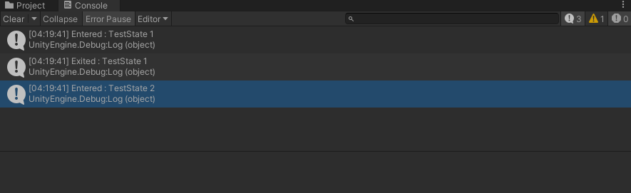

### This tutorial is about creating a StateMachine to create a AI_characters routines that you will find in most typical RPGs


### Skills required
1. Intermediate knowledge of programming in C# (abstract classes and functions, getter / setters, inheritance etc).
2. Intermediate knowledge of unity.

AI is all about decision making and if you are new to AI programming then one of the primitive algorithm that you will learn to code beyond simple decision trees and if else statements is a finite state machine.

A state machine basically has two parts
1. List of States
2. State Machine manager class itself
3. Mostly if not always there is also a global state as well.

The idea behind a state machine is that an entity is managed by a state machine 
1. can have a finite set of states 
2. the entity can only be in one given state at a time.
3. the states themselves are responsible for switching from one state to next.

As an example all the above activities of NPC that we are going to code are separate states managed by a central **StateMachine**.

If you are a patron download project files for this tutorial, it has a starting scene and necessary assets setup.

With this introduction let's code a **Finite State Machine**.

1. Go to **CCP_Tutorials > StateMachine > Demo > Scenes** and open **StartScene**.
2. In **CCP_Tutorials > StateMachine > Scripts > StateMachine** create two new C# scripts **StateMachine.cs** and **State.cs**.
3. Open **State.cs** in visual studio, this is our base state class, the base AI_Character state class will drive from this, I have put both **StateMachine.cs** and **State.cs** in a separate namespace to avoid conflicting names.

```
namespace Game_AI
{
    [System.Serializable]
    public abstract class State
    {
    }
}
```

4. Each state will have a unique identifier, we can do this with a C# **GUID** (Global Unique Identifier), I am saving it as a string otherwise it won't be serialized by unity by default.

```
    [System.Serializable]
    public abstract class State
    {
        // ** public fields **
        [SerializeField] private string guid = "";


        // ** getter / setters ** 
        public string GUID { get { return guid; } }


        // constructor
        public State()
        {
            guid = System.Guid.NewGuid().ToString();
        }
    }
```

5. In a state machine when we switch from a current state to a new state, three events occur in order.  
   * the current state is exited
   * the new state is entered / started
   * the new state is executed every frame. (this execution keeps on until a new switch take place).   
   

We can elegantly handle these three events with abstract method which every state must implement.

```
    public abstract class State
    {
        ^^ previous code ^^
    
        public abstract void Enter();
        public abstract void Execute();
        public abstract void Exit();
    }
```

6. With this out **State.cs** is done, now open **StateMachine.cs**, let's also keep this simple for now and only add features when required.

```
namespace Game_AI
{
    [System.Serializable]
    public class StateMachine
    {
    }
}
```

7. Let's start with keeping references of current and global states.

```
    [System.Serializable]
    public class StateMachine
    {
        // ** public fields **
        [SerializeField] private State currentState = null;
        [SerializeField] private State globalState = null;


        // ** getter / setters ** 
        public State CurrentState { get { return currentState; } }
        public State GlobalState { get { return globalState; } }


        // constructor
        public StateMachine(State global)
        {
            globalState = global;

            // this can be null, but that's OK
            if(globalState != null)
                globalState.Enter();
        }
    }
``` 

8. As you can see the **global state** is set only once in the constructor, however to change **current executing state** needs more than that, add a new method **SwitchState** to change current executing state, see the comments for details

```
       ^^ previous code ^^

        public void SwitchState(State newState)
        {
            // make sure new state is not null
            if(newState == null)
            {
                Debug.Log("Cannot set StateMachine State to null");
                return;
            }

            // this is for first time when current state will be null
            if(currentState == null)
            {
                newState.Enter();
                currentState = newState;
                return;
            }

            // make sure we have a new state
            if(newState.GUID == currentState.GUID)
                return;

            // also make sure new state is not the global state
            if (globalState != null && newState.GUID == globalState.GUID)
                return;

            // exit current state
            currentState.Exit();

            // enter new state
            newState.Enter();

            // set current state to new state
            currentState = newState;
        }
```

9. Now let's add a new method **Update** that will execute every frame and it will update global and current states.

```
       ^^ previous code ^^

        public void Update()
        {
            if (globalState != null)
                globalState.Execute();

            if(currentState != null)
                currentState.Execute();
        }
```

10. And that's it basically we are done, but before we leave for creating an actual AI_Character with this state machine, let's do a simple test with this **Finite StateMachine.cs** implementation of ours to see if it's properly functional at all without any errors.

11. Let's start this by creating a **AI_Character.cs** script in **CCP_Tutorials > StateMachine > Scripts**, attach this script to any game object.

```
[System.Serializable]
public class AI_Character : MonoBehaviour
{
    private void Start()
    {
    }

    private void Update()
    {
    }
}
```

12. Create two new classes **TestState_1** and **TestState_2** both are derived from abstract **State** class and implement the abstract methods of **State** class, you can see that test classes maintains a reference to the **AI_Character** that will own them, these classes also log messages in unity console on **Enter** and **Exit** methods. 

```
[System.Serializable]
public class TestState_1 : Game_AI.State
{
    private AI_Character ai_character = null;


    public TestState_1(AI_Character _ai_character) : base()
    {
        ai_character = _ai_character;
    }

    public override void Enter()
    {
        Debug.Log("Entered : TestState 1");
    }

    public override void Execute()
    {
    }

    public override void Exit()
    {
        Debug.Log("Exited : TestState 1");
    }
}


[System.Serializable]
public class TestState_2 : Game_AI.State
{
    private AI_Character ai_character = null;


    public TestState_2(AI_Character _ai_character) : base()
    {
        ai_character = _ai_character;
    }

    public override void Enter()
    {
        Debug.Log("Entered : TestState 2");
    }

    public override void Execute()
    {
    }

    public override void Exit()
    {
        Debug.Log("Exited : TestState 2");
    }
}
```

13. To test this system update **Execute** method of **TestState_1** as follows, see code, basically we are just switching to **TestState_2** as soon as **Execute** method of **TestState_1** is called, this is simple but it serves the purpose.

```
    public override void Execute()
    {
        ai_character.stateMachine.SwitchState(ai_character.testState_2);
    }
```

15. Back to **AI_Character** class, let's create a reference to **StateMachine** class and our two test state classes, finally set current state of **AI_Character** in **Start method** and call the **Update method** of state machine from **Update method** of **AI_Character** class.

```
    // create references to state machine and test states
    public Game_AI.StateMachine stateMachine = default;
    public TestState_1 testState_1 = default;
    public TestState_2 testState_2 = default;


    private void Start()
    {
        stateMachine = new Game_AI.StateMachine(null);

        testState_1 = new TestState_1(this);
        testState_2 = new TestState_2(this);

        // switch to 
        stateMachine.SwitchState(testState_1);
    }

    private void Update()
    {
        // update state machine every frame.
        stateMachine.Update();
    }
```

16. Enter **PlayMode** if everything is going well then you will see log messages in unity console.



17. And that's basically it we are done, you can now delete **TestState_1** and **TestState_2** classes and all references to them, they have served their intended purpose & see you in next tutorial. 